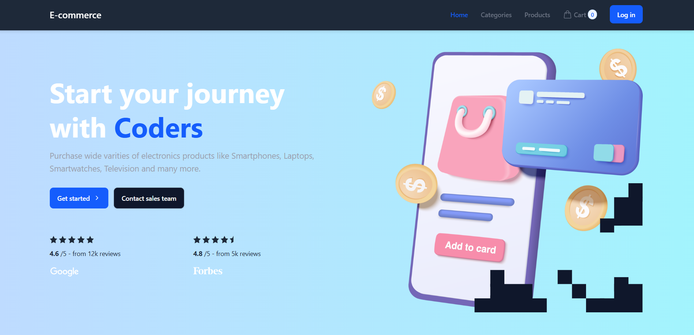
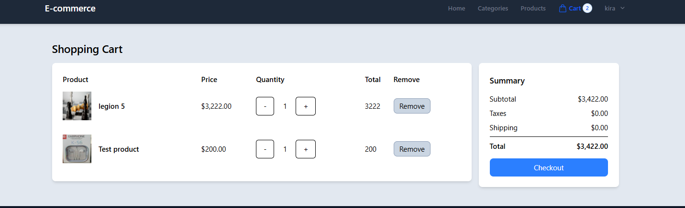
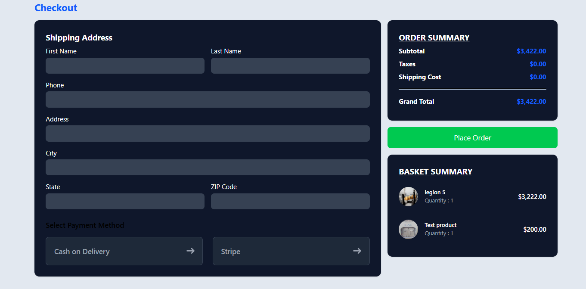
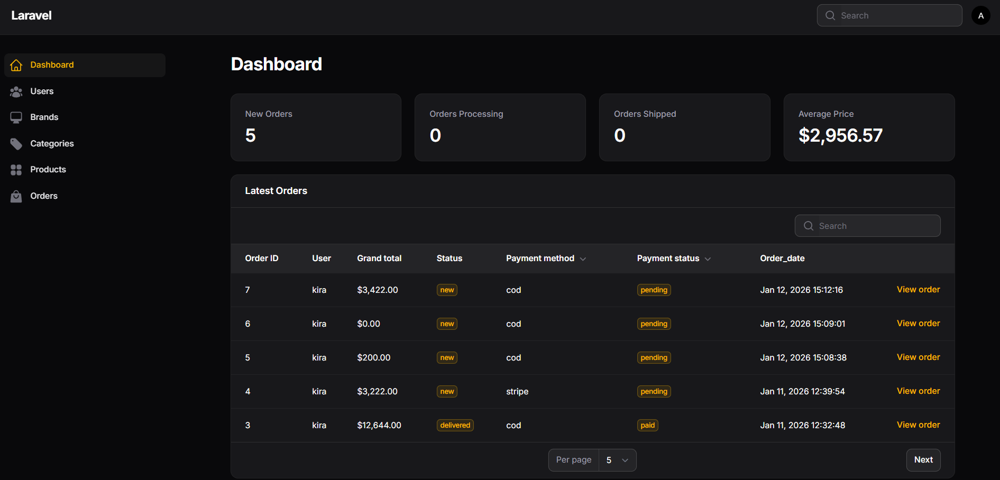

# E-Commerce Web Application

A full-featured E-Commerce web application built using **Laravel 11**, **Livewire 3**, **Filament 3**, and **Tailwind CSS**.

## 🚀 Features

- User authentication (register, login)
- Product listing with categories
- Shopping cart functionality
- Checkout & order management
- Admin dashboard using Filament 3
- Product, category, and order management
- Order statistics & filtering
- Responsive UI with Tailwind CSS
- Payment methods (Cash on Delivery / Stripe)

## 🛠 Tech Stack

- **Backend:** Laravel 11
- **Frontend:** Livewire 3, Blade
- **Admin Panel:** Filament 3
- **Styling:** Tailwind CSS
- **Database:** Sqlite
- **Authentication:** Laravel Auth

## 📂 Project Structure

- MVC architecture
- Clean and scalable codebase
- Database migrations & seeders
- Eloquent ORM relationships


## 📸 Screenshots

### Home Page


### Products Page


### Shopping Cart


### Checkout


### Admin Dashboard



## ⚙️ Installation

```bash
git clone https://github.com/USERNAME/REPO_NAME.git
cd REPO_NAME
composer install
npm install
cp .env.example .env
php artisan key:generate
php artisan migrate --seed
php artisan storage:link
npm run build
php artisan serve
